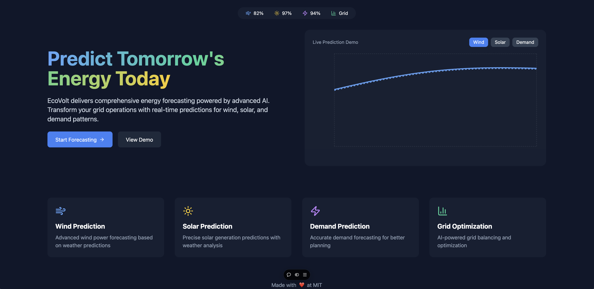
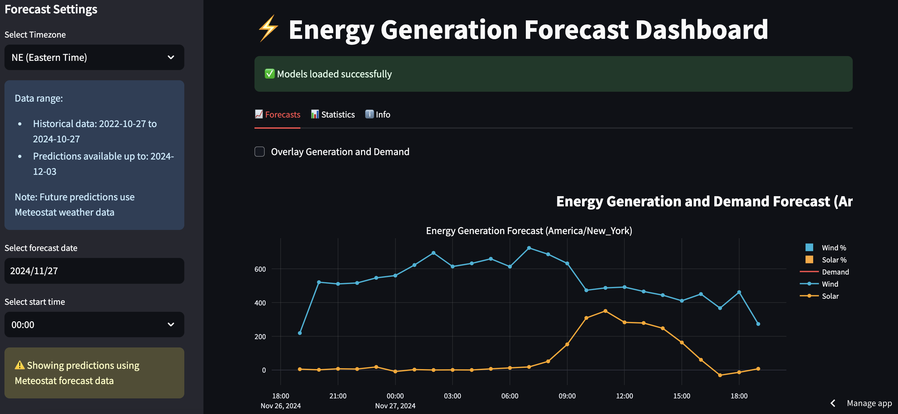
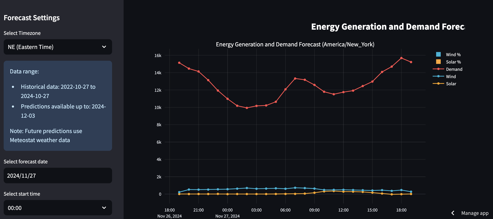
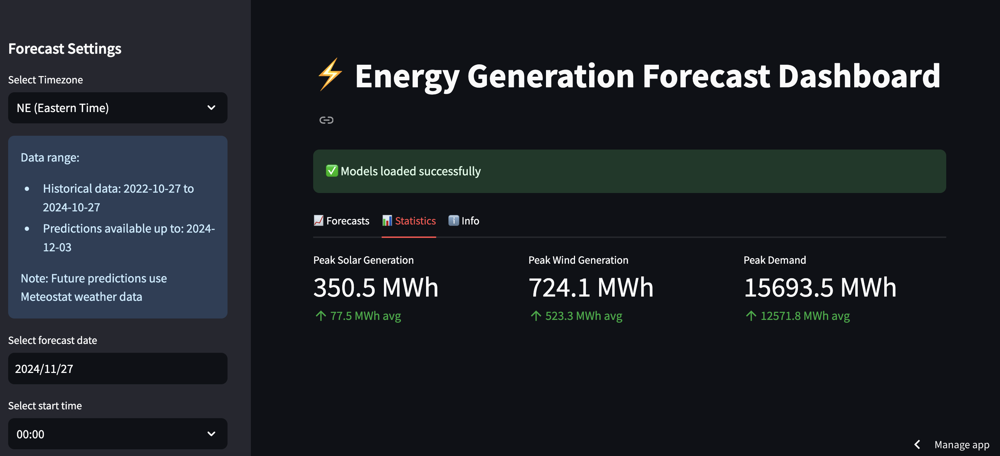
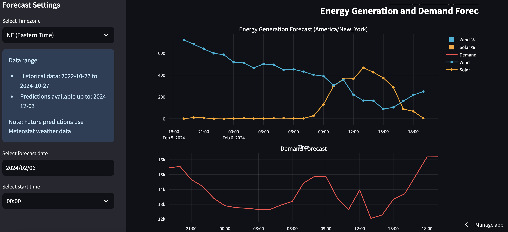
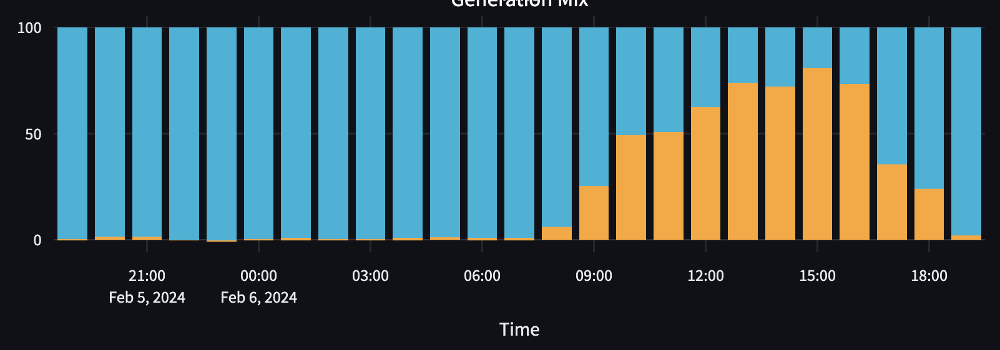
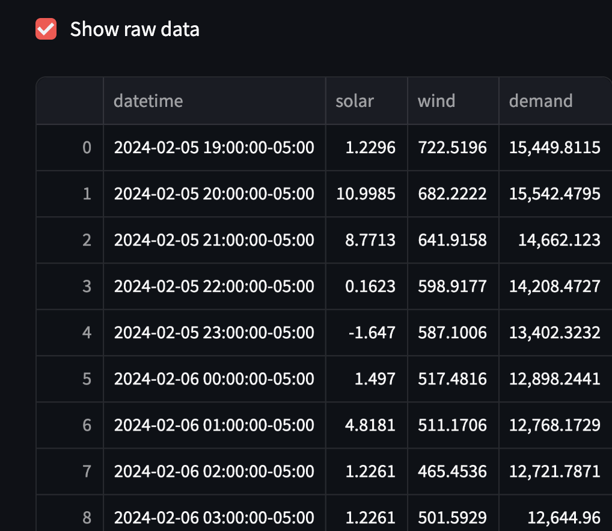
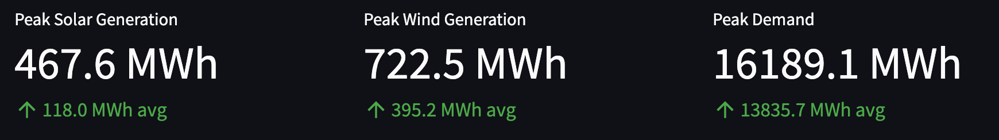
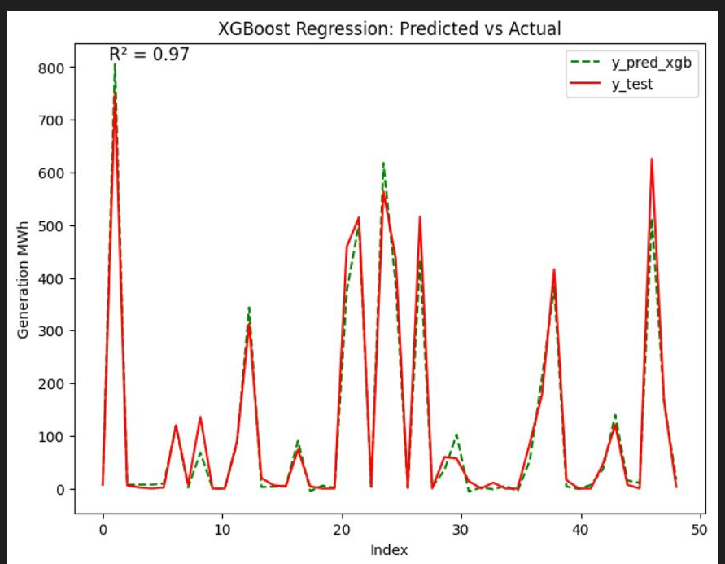
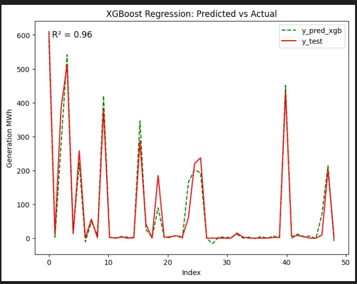

# 1.125: Architecting and Engineering Software Systems - Fall 2024

## INTRODUCTION
This is the project for 1.125: Architecting and Engineering Software Systems Fall 2024.  
The goal of the project is to create an energy forecasting app that is trained on historical
weather data and recorded energy production values. Given weather forecasts, the app predicts 
energy generation and demand for corresponding times.

Project video: https://www.loom.com/share/2e04ecbf32d24c37ab6c353e2717a3c6?sid=c7cf2fa4-d43c-4d00-bb59-968e783c6e58 

## FOLDERS
- `final_deliverable/`: Our final deliverable.
    - `nextjs/`: Code for our brand website.
- `deliverable_2/`: A small implementation of our forecaster with all the assests in one location.
- `data_collection/`: Contains historical weather data and energy production records.
- `Past Implementations/`: Contains past attempts that have been unsuccessful .
    - `Machine_Learning_model/`: Contains an example method of implementing a machine learning model.
    - `progress_tracking/`: Ideally this folder would keep track of where we get our data from and next steps.

# Energy Generation Forecast Dashboard

The Energy Generation Forecast Dashboard is a comprehensive solution that empowers grid operators to make informed decisions and optimize their renewable energy operations. Powered by advanced AI and machine learning, the dashboard delivers precise, real-time predictions for wind, solar, and demand patterns, enabling operators to balance supply and demand, maximize renewable energy generation, and minimize costly inefficiencies.

This dashboard provides energy generation forecasts using machine learning models trained on historical data.

Features:
-Solar generation prediction
-Wind generation prediction
-Demand forecasting
-Generation mix analysis
-Timezone support (Currently showing: NE (Eastern Time))

Data Sources:
-Historical weather data
-Past generation records
-Demand patterns

Links: 
https://energyforecasting.vercel.app/
https://energyforecaster.streamlit.app/ 

## Key Features

- Accurate forecasting for wind, solar, and demand using state-of-the-art XGBoost regression models
- Interactive charts and visualizations built with Streamlit and Plotly for a seamless user experience
- Ability to dynamically switch between different prediction views (wind, solar, demand) to gain a holistic understanding of the energy landscape
- Grid optimization insights, including peak generation and demand, to support load balancing and energy storage strategies
- Robust, scalable backend architecture built with Python and SQLite database
- Containerization with Docker for improved portability and scalability
- Branded website built with NextJS

## Technology Stack

- **Backend**: Python, Streamlit, SQLite
- **Machine Learning**: XGBoost, sklearn
- **Visualization**: Plotly, Lucide Icons
- **Containerization**: Docker
- **Frontend**: NextJS

## Installation and Setup

1. Clone the repository:
git clone https://github.com/clbanjai/AI-Powered-Renewable-Energy-Forecasting-and-Grid-Integration-with-Real-Time-Visualization.git

2. Build the Docker image:
cd energy-forecast-dashboard
docker build -t energy-forecast-dashboard .

3. Run the Docker container:
docker run -p 8501:8501 energy-forecast-dashboard

The application will be available at `http://localhost:8501`.

## Usage

1. Select the forecast date and start time in the Forecast Settings section.
2. Choose the energy type you want to view (wind, solar, or demand) by clicking the corresponding button in the Live Prediction Demo section.
3. Observe the real-time predictions and insights provided by the dashboard.
4. Utilize the grid optimization information to make informed decisions about load balancing and energy storage strategies.

## Contributing

If you would like to contribute to the Energy Generation Forecast Dashboard project, please follow these steps:

1. Fork the repository.
2. Create a new branch for your feature or bug fix.
3. Implement your changes and test thoroughly.
4. Submit a pull request with a detailed description of your changes.

## License

This project is licensed under the [MIT License](LICENSE).

## Contact

For any questions or inquiries, please contact us at [jturliuk@mit.edu](mailto:jturliuk@mit.edu) and [clbanjai@mit.edu](mailto:clbanjai@mit.edu).

## Images

Website:

Interface:

You can also see past data:

Accuracy:

